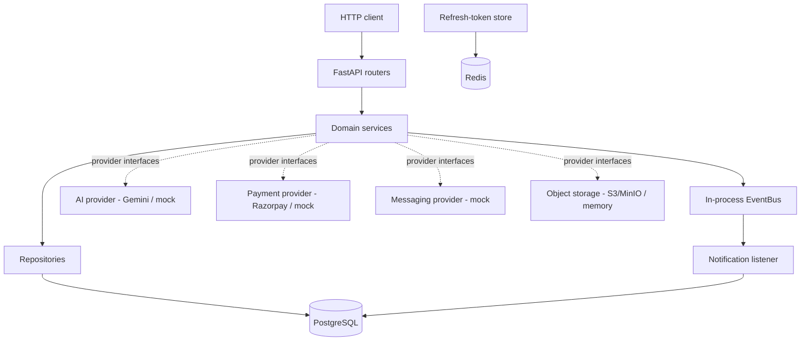

# Vyapar AI

Vyapar AI is a multi-tenant business management platform for micro, small, and
medium enterprises (MSMEs). It combines a conventional commerce backend —
catalog, inventory, customers, orders, payments, and invoices — with an AI
assistance layer for catalog generation and a conversational interface. It is
implemented as a Python/FastAPI modular monolith with strict tenant isolation,
provider abstractions for all external services, and database-enforced business
invariants.


---

## Overview

Vyapar AI gives a small business a single backend to run its day-to-day
operations: define a product catalog, track stock, record customers and orders,
take payments, and issue invoices. On top of that transactional core it adds two
AI-assisted capabilities: generating structured product catalog drafts from a
short description, and answering merchant messages (product search, stock
lookup, stock adjustment) through a conversational endpoint.

The system is **multi-tenant**: many independent businesses share one
deployment, and every business only ever sees its own data. It is designed as a
backend service — it exposes a JSON/HTTP API and OpenAPI documentation, and does
not include a frontend.

The intended users are:

- **Business owners (`OWNER`)** — full control over their business, including
  sensitive actions.
- **Staff (`EMPLOYEE`)** — day-to-day catalog and inventory operations.
- **Administrators (`ADMIN`)** — elevated read access to financial reporting.

## Problem statement

Small merchants typically manage their catalog, stock, orders, and billing
across disconnected tools (paper, spreadsheets, chat messages). This makes it
hard to keep inventory accurate, produce consistent invoices, or get a reliable
view of sales. Onboarding a product catalog by hand is slow, and answering
routine questions ("do we have this in stock?", "add 10 units") is repetitive
manual work.

## Solution

Vyapar AI consolidates these concerns into one backend built around a few ideas:

- A **deterministic business core** — catalog, inventory, orders, payments, and
  invoices — where all state changes go through validated domain services and
  database transactions.
- An **AI assistance layer** that *proposes* structured data (catalog drafts,
  resolved conversational intents) but never writes business data directly. A
  human approves catalog drafts, and conversational intents are executed only by
  the same deterministic domain services, after a confidence check.
- **Provider abstractions** for every external dependency (AI, payments,
  messaging, object storage), so the domain depends on interfaces rather than
  vendor SDKs and adapters can be swapped or mocked.
- **Read-only analytics** computed directly from the transactional tables, and a
  dashboard that composes them into a single view.

External messaging delivery (WhatsApp/Meta) is **not** part of the current
implementation; see [Current status](#current-status) and
[Known limitations](#known-limitations).

## Key capabilities

Only capabilities present in the repository are listed.

- **Authentication & business management** — registration (business + owner in
  one atomic step), JWT login, refresh-token rotation/revocation, user
  management, business profile/settings, and a Business PIN for sensitive
  actions.
- **Product catalog** — categories, products, product images (stored in object
  storage), keyword and category filtering, and soft delete.
- **AI catalog generation** — generate structured product *drafts* from a short
  input, review/edit/regenerate them, and approve a draft to create a real
  product. Approval is an explicit human action.
- **Inventory management** — per-product stock records, atomic stock
  adjustments under row-level locking, stock-movement history, and low-stock
  detection.
- **Conversational AI** — a message endpoint that resolves an intent (product
  search, stock lookup, stock adjustment), gates it on a confidence threshold,
  and executes it through the deterministic domain services.
- **Customer management** — customers and their addresses, tenant-scoped.
- **Order management** — orders with line-item snapshots and an explicit status
  state machine (created → confirmed → paid → … → completed, or cancelled).
- **Payment management** — online and cash-on-delivery payments through a
  payment provider abstraction, with verification/confirmation and financial
  state transitions.
- **Invoice management** — invoices generated from orders, rendered to PDF and
  stored in object storage; invoice records are treated as immutable.
- **Notifications** — in-app notifications persisted from domain events
  (order/payment status changes, low stock).
- **Analytics** — SQL-computed sales, revenue, and top products over configurable
  time periods.
- **Dashboard** — a single composed KPI view (sales + recent orders + low stock
  + unread notifications).

## System architecture

Vyapar AI is a **modular monolith** organized package-by-feature. Each domain
module follows the same layering:

```
router (thin HTTP)  →  schemas (Pydantic)  →  service (logic + transactions)  →  repository  →  models (SQLAlchemy)
```

All external infrastructure sits behind `typing.Protocol` abstractions, wired in
a single composition root (`app/providers.py`).



Redis currently backs only the refresh-token revocation store (in staging /
production); it is not used for caching.

## Architecture principles

- **Modular domain architecture** — one package per business domain, each
  self-contained (`router`, `schemas`, `service`, `repository`, `models`).
- **Service/repository separation** — services own logic and transactions;
  repositories own tenant-scoped queries.
- **Tenant isolation** — every business-owned query is filtered by a
  `business_id` derived from the authenticated principal, never from client
  input.
- **Provider abstraction** — AI, payments, messaging, and storage are accessed
  through interfaces; concrete adapters are selected explicitly in the
  composition root and never fall back silently in production.
- **AI as an assistance layer** — the model produces structured data only;
  deterministic domain services perform all writes.
- **Database-enforced invariants** — uniqueness, tenant scoping, and financial
  constraints are enforced at the schema level, not only in application code.
- **Transactional consistency & concurrency control** — multi-step operations
  run in a single transaction; stock and payment updates take row-level locks
  (`SELECT ... FOR UPDATE`).
- **Immutable financial records** — invoices are generated once and not mutated.

## Domain modules

Located under `app/`. Each is architecturally independent; cross-module use goes
through service interfaces.

| Module | Purpose |
|---|---|
| `common/` | Shared primitives: `Money`, exceptions, domain events (`EventBus`), security (JWT/RBAC/PIN), `ObjectStorage`, `MessagingProvider`, DB mixins, error handlers. |
| `auth/` | Registration, login, JWT access/refresh tokens (rotation + revocation), RBAC, PIN step-up. |
| `business/` | Business profile/settings, WhatsApp number linkage, payment preferences, Business PIN. |
| `catalog/` | Categories, products, product images, filtering, soft delete. |
| `catalogai/` | AI catalog draft generation, review/regenerate/reject, and approval into a real product. |
| `inventory/` | Stock records, atomic adjustments (row-locked), stock movements, low-stock events. |
| `conversation/` | Conversational intent pipeline over catalog/inventory. |
| `customer/` | Customers and addresses. |
| `order/` | Orders, line-item snapshots, status state machine. |
| `payment/` | Online/COD payments through the payment provider, verification, state transitions. |
| `invoice/` | Invoice records and PDF rendering (ReportLab) into object storage. |
| `notification/` | In-app notifications persisted from domain events via an event listener. |
| `analytics/` | Read-only SQL aggregation: sales, revenue, top products. |
| `dashboard/` | Composed KPI view over analytics, orders, inventory, notifications. |

Root-level wiring: `config.py` (settings), `db.py` (engine/session),
`redis_client.py`, `providers.py` (composition root), `main.py` (app factory
and router mounting), `dev_sim.py` (non-production message simulation).

## AI architecture

AI is treated as a **suggestion source, not an authority**. Two independent AI
seams exist, each behind its own `Protocol`:

- **Catalog AI** (`app/catalogai/provider.py`) — `AiProvider`, with a
  deterministic `MockAiProvider` (dev/test) and a `GeminiAdapter`
  (`app/catalogai/adapters/gemini.py`).
- **Conversational AI** (`app/conversation/provider.py`) —
  `ConversationAiProvider`, with `MockConversationAiProvider` and a
  `GeminiConversationAdapter` (`app/conversation/adapters/gemini.py`).

The provider is selected explicitly via `AI_PROVIDER` (`mock` | `gemini`).
`gemini` requires `AI_API_KEY` and fails loudly if it is missing; `mock` is
rejected in a production environment rather than silently used.

The conversational execution flow makes the boundary explicit:

```
User message
  → AI provider resolves a structured intent + confidence
  → confidence gate (AI_CONFIDENCE_THRESHOLD; low confidence → ask for clarification)
  → intent routed to a handler
  → deterministic domain service (catalog / inventory)
  → validation + database transaction
  → deterministic reply → MessagingProvider
```

Security properties of the AI layer:

- `business_id` comes from the caller/authenticated context, **never** from the
  model output.
- The model cannot write business data; only domain services can.
- Provider and domain failures are converted to controlled, generic replies —
  stack traces, SQL, and provider internals are never surfaced to the user
  (prompt-injection / information-leak containment).
- Catalog drafts require an explicit human **approval** transition before a
  product is created.

## Authentication and security

- **JWT authentication** with separate **access** and **refresh** tokens
  (HS256). Access tokens are short-lived (default 15 min); refresh tokens are
  longer-lived (default 14 days).
- **Refresh-token rotation and revocation** — refresh rotates the token and
  revokes the old one; logout revokes it. The revocation store is in-memory in
  development and **Redis-backed** in staging/production so it is shared across
  workers and survives restarts.
- **RBAC** — roles `OWNER`, `EMPLOYEE`, `ADMIN`, enforced with a `require_role`
  dependency.
- **Business PIN** — a step-up secret required for sensitive actions (e.g.
  deleting a product, changing payout/payment preferences).
- **Tenant isolation & IDOR protection** — cross-tenant access returns 404;
  resources are always looked up within the caller's `business_id`.
- **Secret handling** — all secrets come from the environment; none are
  hard-coded. Passwords/PINs are hashed (bcrypt via passlib).

## Multi-tenancy

`business` is the tenant root. A business is created atomically with its owner
during registration. The authenticated principal carries `business_id` in its
token claims, and **every** business-scoped repository query filters on that
value. Client-supplied identifiers are only ever used to look *within* the
caller's tenant, so a client cannot read or mutate another business's data by
guessing IDs.

## Data architecture

- **PostgreSQL 16** as the system of record.
- **SQLAlchemy 2.0** ORM with typed models; **Alembic** for schema migrations.
- Relational structure includes business → users, categories → products →
  images, products → inventory → stock movements, customers → addresses,
  orders → order items, payments, invoices, and notifications.
- **Constraints** enforce tenant scoping and business rules at the database
  level (e.g. unique WhatsApp number across businesses, one successful payment
  per order, partial-unique notification dedup keys).
- **Transactions** wrap multi-step operations; **row-level locking**
  (`SELECT ... FOR UPDATE`) protects stock adjustments and payment state
  transitions from lost updates under concurrency.
- **Money** is handled with `Decimal`/`NUMERIC` — never floats — via the shared
  `Money` primitive.

Schema decisions per phase are documented under `docs/` (see
[Documentation](#documentation)).

## Event architecture

`app/common/events.py` defines a **minimal, synchronous, in-process
`EventBus`** (Observer pattern). Domain services publish events without knowing
their consumers; a handler failure is isolated so it cannot break the publisher.

Current events: `LowStock`, `OrderCreated`, `OrderConfirmed`, `OrderCancelled`,
`PaymentSucceeded`, `PaymentFailed`.

- **Producers**: order, payment, and inventory services.
- **Consumer**: `NotificationEventListener` (`app/notification/listener.py`),
  which persists in-app notifications.
- **Post-commit, best-effort delivery**: the listener uses its own database
  session so a notification write can never roll back a committed domain change.

**Limitation (by design, not hidden):** delivery is in-process with no outbox or
broker. A crash between the domain commit and the notification write loses that
one notification. This is **not** durable messaging.

## External provider architecture

Every external dependency is accessed through an interface, with a mock/in-memory
implementation for development and tests and a real adapter selected by
configuration:

| Interface | Purpose | Implemented adapters | Selection |
|---|---|---|---|
| `AiProvider` / `ConversationAiProvider` | AI catalog + conversational intent | `mock`, `GeminiAdapter` | `AI_PROVIDER` |
| `PaymentProvider` | Payment gateway | `mock`, `RazorpayAdapter` | `PAYMENT_PROVIDER` |
| `MessagingProvider` | Outbound/inbound messaging | `mock` only | `MESSAGING_PROVIDER` |
| `ObjectStorage` | Binary storage (images, PDFs) | in-memory, S3/MinIO | `STORAGE_BACKEND` |

```
Application → Provider interface → Provider adapter → External service
```

The composition root (`app/providers.py`) constructs these singletons.
Selection is explicit and **fails loudly** in production if a mock is requested
where a real adapter is required — there is no silent fallback.

> **Note on live verification:** the Gemini and Razorpay adapters exist in code,
> but this documentation does **not** claim they were verified against live
> credentials. The `whatsapp` messaging provider is **not implemented** —
> selecting it raises `NotImplementedError`.

## Storage

| Component | Role |
|---|---|
| **PostgreSQL** | Primary transactional datastore (system of record). |
| **Redis** | Refresh-token revocation store (staging/production only). Not used for caching. |
| **Object storage (MinIO / S3-compatible)** | Product images and invoice PDFs, referenced by URL — never stored in Postgres. `STORAGE_BACKEND=memory` uses an in-process fake for dev/tests; `s3` targets MinIO/S3. |

## API

The API is grouped by domain. All application routes are mounted under `/api`,
except health and the non-production dev simulation endpoint.

| Group | Prefix | Notes |
|---|---|---|
| Auth | `/api/auth` | register, login, refresh, logout, user management |
| Business | `/api/business` | profile, WhatsApp link, PIN, payment preferences |
| Catalog | `/api` | `/categories`, `/products`, product images |
| Catalog AI | `/api/catalog-ai` | drafts: generate, review, regenerate, reject, approve |
| Inventory | `/api/inventory` | stock records, adjust, movements |
| Conversation | `/api/conversation` | `POST /message` (intent pipeline) |
| Customers | `/api/customers` | customers and addresses |
| Orders | `/api/orders` | create, list, transition (state machine) |
| Payments | `/api/payments` | create, verify, confirm-cod |
| Invoices | `/api/invoices` | create, list, `GET /{id}/pdf` |
| Notifications | `/api/notifications` | list, read, read-all |
| Analytics | `/api/analytics` | `/sales`, `/top-products` (OWNER/ADMIN) |
| Dashboard | `/api/dashboard` | `/summary` (OWNER/ADMIN) |
| Health | `/healthz` | liveness/readiness probe |

The authoritative, always-current reference is the generated OpenAPI schema. See
[API documentation](#api-documentation).

## Project structure

```
vyapar-ai/
├── app/
│   ├── common/          # Money, events, security, storage, messaging, exceptions
│   ├── auth/            # authentication, JWT, RBAC, PIN
│   ├── business/        # business profile & settings
│   ├── catalog/         # categories, products, images
│   ├── catalogai/       # AI catalog drafts (adapters/: gemini)
│   ├── inventory/       # stock records & movements
│   ├── conversation/    # conversational intent pipeline (adapters/: gemini)
│   ├── customer/        # customers & addresses
│   ├── order/           # orders & state machine
│   ├── payment/         # payments (adapters/: razorpay)
│   ├── invoice/         # invoices & PDF rendering
│   ├── notification/    # in-app notifications & event listener
│   ├── analytics/       # read-only sales/revenue aggregation
│   ├── dashboard/       # composed KPI view
│   ├── config.py        # typed settings
│   ├── db.py            # engine/session
│   ├── redis_client.py  # Redis client
│   ├── providers.py     # composition root (provider selection)
│   ├── dev_sim.py       # non-production message simulation
│   └── main.py          # app factory & router mounting
├── alembic/             # migrations (one revision per phase)
├── tests/
│   ├── unit/
│   └── integration/
├── docs/                # per-phase architecture & schema decisions
├── Dockerfile
├── docker-compose.yml
├── pyproject.toml
└── .env.example
```

## Technology stack

| Layer | Technology |
|---|---|
| Language | Python 3.12 |
| API framework | FastAPI |
| Validation | Pydantic v2 / pydantic-settings |
| ORM | SQLAlchemy 2.0 |
| Migrations | Alembic |
| Database | PostgreSQL 16 |
| Supporting store | Redis 7 (refresh-token revocation) |
| Object storage | MinIO / S3-compatible (boto3) |
| AI | Gemini via provider abstraction (mock default) |
| Payments | Razorpay via provider abstraction (mock default) |
| Authentication | JWT (PyJWT), bcrypt (passlib) |
| PDF | ReportLab |
| HTTP client | httpx |
| Containers | Docker / Docker Compose |
| Testing | pytest, pytest-cov, pytest-asyncio |
| Linting/formatting | Ruff |
| Type checking | mypy (strict) |
| Security analysis | Bandit |

## Local development setup

**Prerequisites:** Python 3.12, Docker + Docker Compose.

```bash
# 1) Create and activate a virtualenv
python -m venv .venv
source .venv/Scripts/activate          # Windows (Git Bash); use .venv/bin/activate on Linux/macOS

# 2) Install the project with dev + storage extras
pip install -e ".[dev,storage]"

# 3) Configure the environment
cp .env.example .env

# 4) Start the datastores
docker compose up -d db redis minio

# 5) Apply database migrations
alembic upgrade head

# 6) Run the application
uvicorn app.main:app --reload --port 8080

# 7) Health check
curl http://localhost:8080/healthz      # {"status":"ok","environment":"development"}

# 8) Run the tests (see Testing)
pytest --cov=app --cov-report=term-missing
```

The `pdf` extra (`pip install -e ".[dev,storage,pdf]"`) adds ReportLab, required
for invoice PDF generation.

## Environment variables

Defined in `.env.example` and typed in `app/config.py`. Secrets must not be
committed.

| Variable | Purpose | Required |
|---|---|---|
| `ENVIRONMENT` | `development` \| `test` \| `staging` \| `production` | No (default `development`) |
| `DEBUG` | Enable debug mode | No |
| `DB_URL` | PostgreSQL connection URL | Yes |
| `REDIS_URL` | Redis connection URL | Yes (staging/production) |
| `JWT_SECRET` | JWT signing secret | Yes (strong value outside dev) |
| `JWT_ACCESS_TTL_SECONDS` | Access-token lifetime | No |
| `MESSAGING_PROVIDER` | `mock` \| `whatsapp` (`whatsapp` not implemented) | No (default `mock`) |
| `WA_VERIFY_TOKEN` / `WA_API_TOKEN` / `WA_PHONE_NUMBER_ID` | WhatsApp config (unused until implemented) | No |
| `AI_PROVIDER` | `mock` \| `gemini` | No (default `mock`) |
| `AI_API_KEY` | Gemini API key (required when `AI_PROVIDER=gemini`) | Conditional |
| `AI_MODEL` | AI model id | No |
| `AI_CONFIDENCE_THRESHOLD` | Minimum confidence for actionable intents | No (default `0.6`) |
| `PAYMENT_PROVIDER` | `mock` \| `razorpay` | No (default `mock`) |
| `RZP_KEY` / `RZP_SECRET` | Razorpay credentials (required when `PAYMENT_PROVIDER=razorpay`) | Conditional |
| `DEFAULT_TAX_RATE` | Configurable order tax rate (no hard-coded GST) | No (default `0.0`) |
| `DEFAULT_CURRENCY` | Expected payment currency | No (default `INR`) |
| `NOTIFICATIONS_ENABLED` | Enable the notification event listener | No (default `true`) |
| `BUSINESS_TIMEZONE` | Timezone for analytics period boundaries | No (default `UTC`) |
| `STORAGE_BACKEND` | `memory` \| `s3` | No (default `memory`) |
| `S3_ENDPOINT_URL` / `S3_ACCESS_KEY` / `S3_SECRET_KEY` / `S3_BUCKET` / `S3_REGION` | Object storage config | Conditional (when `s3`) |

## Docker

`docker-compose.yml` defines four services:

- `app` — the FastAPI application (Python 3.12 slim image, non-root user, health
  check on `/healthz`).
- `db` — PostgreSQL 16, with a `pg_isready` health check.
- `redis` — Redis 7, with a `ping` health check.
- `minio` — S3-compatible object storage (console on port 9001).

The `app` service waits for the datastores to become healthy before starting.
Full stack:

```bash
cp .env.example .env
docker compose up -d --build
docker compose exec app alembic upgrade head
curl http://localhost:8080/healthz
```

## Database migrations

Alembic manages all schema changes. `create_all` is **not** used in the runtime
path.

```bash
alembic upgrade head                       # apply all migrations
alembic downgrade -1                        # roll back one revision
alembic revision --autogenerate -m "msg"    # generate a new migration from model changes
```

Migrations are organized one revision per phase (business/users → catalog →
catalog AI → inventory → customer/order → payment → invoice → notification).

## Testing

Tests live under `tests/` and are split into `unit/` and `integration/`. At the
time of writing the suite contains **~350 test functions**.

- **Unit tests** cover pure logic: money, security, schemas, provider mocks,
  event bus, and per-domain service logic.
- **Integration tests** exercise the API against a **real PostgreSQL database**,
  with each test wrapped in a rolled-back transaction for isolation.
- **Security tests** (`test_*_security.py`) assert tenant isolation, RBAC, PIN
  enforcement, and IDOR protection per module.
- **Concurrency tests** (`test_*_concurrency.py`) verify row-level locking for
  inventory, orders, payments, and invoices against committed PostgreSQL data.
- **External providers are mocked** by default; the mock adapters are
  deterministic.

```bash
docker compose up -d db          # integration tests need PostgreSQL
pytest --cov=app --cov-report=term-missing
```

Test counts reflect the state at documentation time.

## Quality gates

| Tool | Purpose |
|---|---|
| **Ruff** | Linting and formatting (`ruff check .`, `ruff format --check .`). |
| **mypy (strict)** | Static type checking (`mypy app`). |
| **Bandit** | Static security analysis (`bandit -r app`). |
| **pytest / coverage** | Automated tests and coverage reporting. |

```bash
ruff check . && ruff format --check .
mypy app
bandit -r app
pytest --cov=app --cov-report=term-missing
```

## Security model

- **Authentication** — JWT access/refresh with rotation and revocation.
- **Authorization** — RBAC (`OWNER`/`EMPLOYEE`/`ADMIN`) plus a Business PIN
  step-up for sensitive operations.
- **Tenant isolation** — `business_id` is derived from the token, never trusted
  from client input; cross-tenant access returns 404.
- **Secret handling** — secrets are environment-sourced; passwords/PINs are
  bcrypt-hashed; no secrets in code or in this document.
- **Input validation** — all request bodies are validated by Pydantic schemas.
- **Provider boundaries** — external services are isolated behind interfaces;
  production refuses mock providers where real adapters are required.
- **Payment boundaries** — currency and business identity are server-trusted,
  not client-supplied; payment state transitions are row-locked.
- **AI prompt-injection containment** — the model cannot write data, cannot set
  `business_id`, and provider/domain errors never leak internals to users.

## Current status

| Component | Status |
|---|---|
| Foundation | Implemented |
| Authentication & Business | Implemented |
| Catalog | Implemented |
| AI Catalog Generation | Implemented (Gemini adapter present; live credentials not verified) |
| Inventory | Implemented |
| Conversational AI | Implemented (mock + Gemini adapter; live credentials not verified) |
| Customers & Orders | Implemented |
| Payments | Implemented (Razorpay adapter present; live gateway not verified) |
| Invoices | Implemented (records + PDF) |
| Notifications | Implemented (in-app only) |
| Analytics | Implemented |
| Dashboard | Implemented |
| WhatsApp / Meta integration | Not implemented (deferred) |
| External notification delivery (WhatsApp/email) | Not implemented (deferred) |

## Known limitations

These are actual limitations verified against the repository:

- **No live external verification** — the Gemini and Razorpay adapters exist but
  are not documented as tested against live credentials/gateways.
- **WhatsApp/Meta not implemented** — selecting `MESSAGING_PROVIDER=whatsapp`
  raises `NotImplementedError`; the conversational pipeline runs through the
  `MessagingProvider` boundary, not WhatsApp.
- **In-process event delivery** — the `EventBus` has no outbox or broker; a
  crash between a domain commit and the notification write loses that
  notification. Not durable messaging.
- **In-app notifications only** — no external (WhatsApp/email) delivery channel.
- **No caching layer** — analytics/dashboard are computed on each request;
  Redis is used only for refresh-token revocation.
- **No production-scale load testing** — no scalability benchmarks have been
  performed. Docker working locally does not imply production readiness.
- **Business-wide notification state** — read/unread is tracked per business,
  not per user (single-merchant MVP assumption).

## Future scope

Clearly separate from what is implemented today. Potential future work:

- WhatsApp/Meta integration (real messaging provider adapter).
- External notification delivery channels (WhatsApp, email).
- Stronger event-delivery guarantees (transactional outbox / broker).
- Live verification and hardening of the AI and payment adapters.
- Additional conversational workflows beyond search/stock lookup/adjustment.
- Production hardening (observability, load testing).

## API documentation

FastAPI serves interactive OpenAPI documentation when the app is running:

- Swagger UI: `http://localhost:8080/docs`
- ReDoc: `http://localhost:8080/redoc`
- OpenAPI schema: `http://localhost:8080/openapi.json`

These are FastAPI defaults; no custom docs path is configured in the app.

## Documentation

Per-phase architecture and schema decision records live under `docs/`:

- `docs/phase4_schema_decision.md` — AI catalog draft schema
- `docs/phase5_schema_decision.md` — inventory & stock movement
- `docs/phase6_architecture_decision.md` — conversational AI
- `docs/phase7_schema_decision.md` — customer & order
- `docs/phase8_schema_decision.md` — payment
- `docs/phase9_schema_decision.md` — invoice
- `docs/phase10_architecture_decision.md`, `docs/phase10_schema_decision.md` — notifications, analytics & dashboard

Detailed product/requirements documents (PDD, SRS, SDD, LLD) are maintained
outside the application repository.

## Development workflow

1. Create a branch for the change.
2. Implement the change within the relevant domain module.
3. If the schema changed, create an Alembic migration.
4. Run the quality gates: `ruff`, `mypy app`, `bandit -r app`.
5. Run the tests (`pytest`) against a running PostgreSQL.
6. Verify the Docker build/stack if infrastructure changed.
7. Commit.
